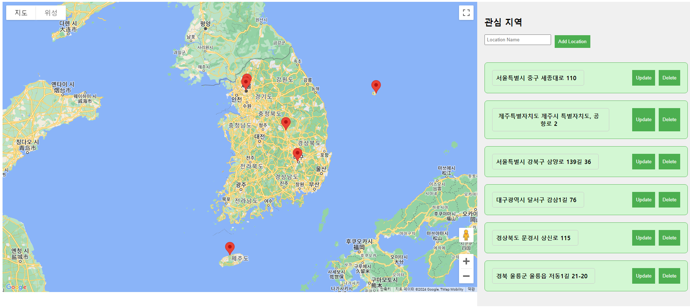
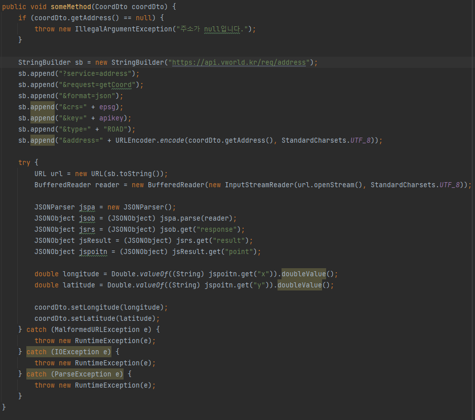
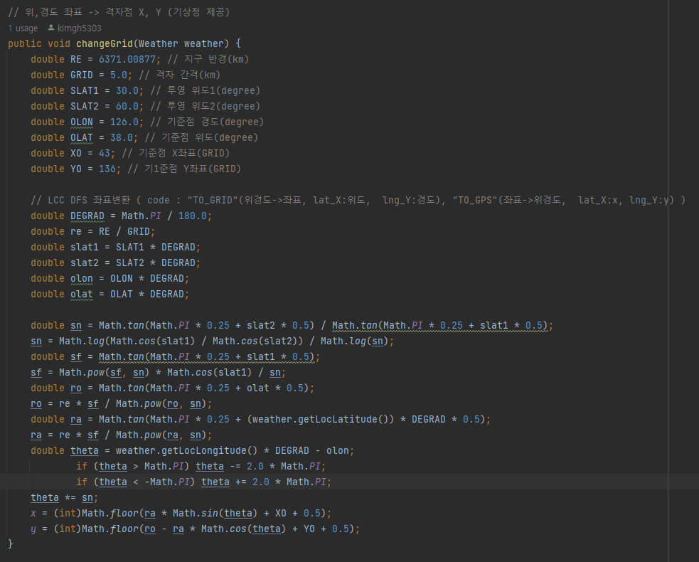
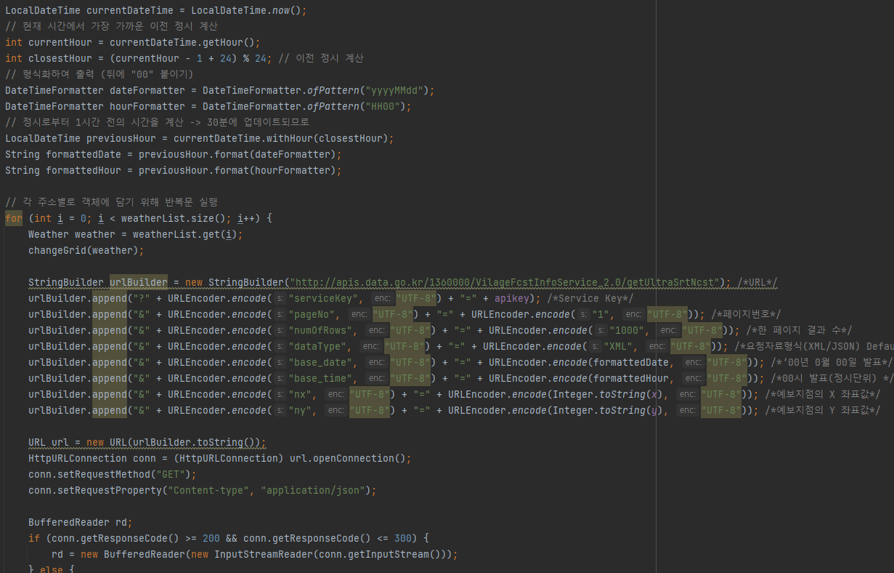
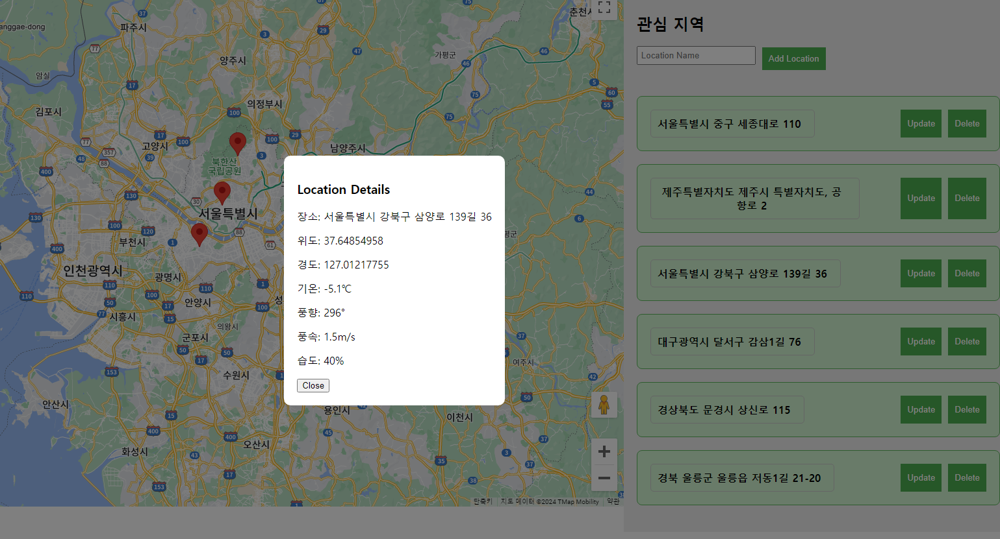

# Weather_API 개인 프로젝트

 

## 프로젝트 주제
위치 기반 초단기 실황 날씨 정보 조회

 

구현 목표
- React 구글 Map API 화면
- REST API 통신
- 도로명 주소 정보를 위, 경도 좌표로 변환
  - Geocoder API 2.0
- 위, 경도 좌표 격자점 변환
- 격자점 데이터로 기상청 초단기 실황 정보를 가져옴
  - 기상청 초단기 실황 API
- XML 파싱하여 필요 데이터 추출

 

## 메인 화면

## Geocoder API

## 격자점 변환

## 기상청 API

## 날씨 정보 조회

 

## 느낀점
외부 API를 제대로 다뤄볼 수 있어서 좋았습니다. 원래는 API에 대한 팀 발표였지만 어떻게 사용되는지에 대하여 예시로 알려주고 문서화시키면 좋겠다고 판단해서 2~3일간 만들어봤습니다. ABB 해커톤때 API를 적용하느라 힘들었었는데 다시 한 번 도전하는데도 쉽지는 않았습니다. 기상청 공식 API 문서가 가독성이 떨어지다보니 격자점이 필요하다는 사실을 나중에 알게 되었고 여기서 많이 고생했습니다.

래퍼런스를 꼭 제대로 읽고 체크하는 습관을 기를 수 있었고 재밌고 좋은 경험이었습니다.
